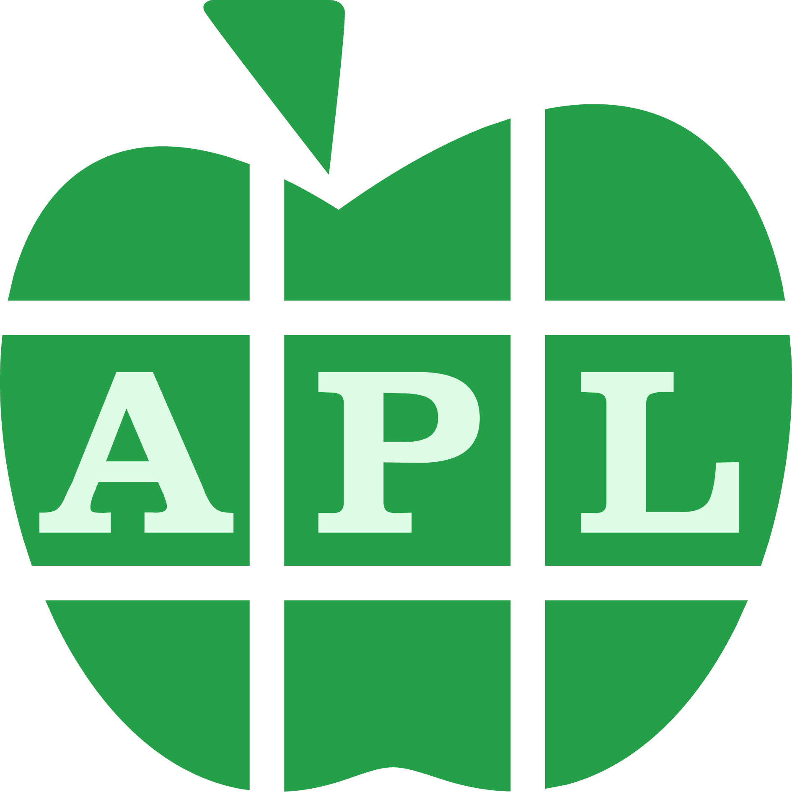

# AdventOfCode
My attempts of some [Advent of Code](https://adventofcode.com/) puzzles. 
Inputs taken from stdin unless specified otherwise.

## 2023
| Day | Solution                                                                                                                                                                      |
|-----|-------------------------------------------------------------------------------------------------------------------------------------------------------------------------------|
| 1   | [ Python](2023/python/01.py) |
| 2   |                                                                                                                                                                               |
| 3   | [ Python](2023/python/03.py) |
| 4   | [ Python](2023/python/04.py) |
| 5   | [ Python](2023/python/05.py) |
| 6   | [ Python](2023/python/06.py) |
| 7   | [ Python](2023/python/07.py) |
| 8   | [ Python](2023/python/08.py) |
| 9   | [ Python](2023/python/09.py) |

## 2022
|Day|Solution|
|-|-|
|1|   [📄 AWK](2022/awk/01.awk)  [ F#](2022/fsharp/01.fs)  [📄 Pascal](2022/pascal/01.pas)  [ Python](2022/python/01.py) |
|2|   [📄 AWK](2022/awk/02.awk)  [ C](2022/c/02.c)  [ F#](2022/fsharp/02.fs)  [ Python](2022/python/02.py) |
|3|   [ APL](2022/apl/03.apl)  [📄 AWK](2022/awk/03.awk)  [ Python](2022/python/03.py) |
|4|   [📄 AWK](2022/awk/04.awk)  [ C](2022/c/04.c)  [ F#](2022/fsharp/04.fs)  [ SQL](2022/sql/04.sql) |
|5|   [ Python](2022/python/05.py)  [ SQL](2022/sql/05.sql) |
|6|   [ APL](2022/apl/06.apl)  [ Java](2022/java/Day06.java)  [ Python](2022/python/06.py) |
|7|   [ F#](2022/fsharp/07.fsx)  [ Python](2022/python/07.py) |
|8|   [ Python](2022/python/08.py) |
|9|   [ Python](2022/python/09.py) |
|10|   [📄 AWK](2022/awk/10.awk)  [ Java](2022/java/Day10.java) |
|11|   [ Python](2022/python/11.py) |
|12|   [ Java](2022/java/Day12.java) |
|13|   [ Python](2022/python/13.py) |
|14|   [ Python](2022/python/14.py) |
|15|   [ Java](2022/java/Day15.java) |
